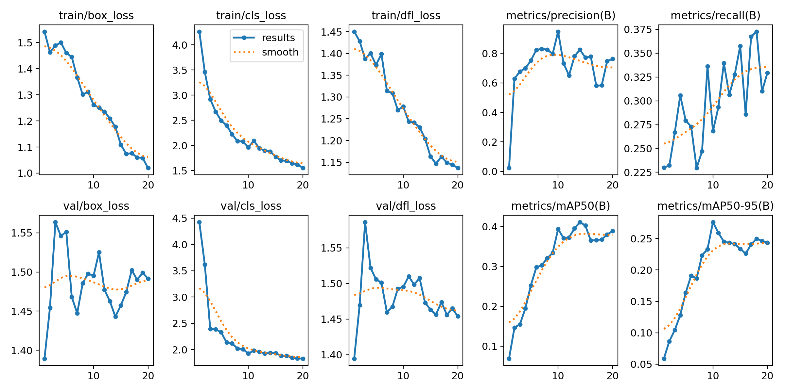

# 🦺 Construction Site Safety Detector

A real-time construction site safety detection app built with **YOLOv8** and deployed with **Streamlit**.
The model was custom trained on 717 construction site images to detect safety violations automatically.

---

## 🚀 Live Demo
👉 [Click here to try the app]() ← we will add this link after deployment

---

## 📸 What It Detects

| Object | Type |
|--------|------|
| ✅ Hardhat | Safe |
| ❌ NO-Hardhat | Violation |
| ✅ Safety Vest | Safe |
| ❌ NO-Safety Vest | Violation |
| 🟡 Person | Neutral |
| 🟡 Safety Cone | Neutral |
| 🟡 Machinery | Neutral |
| 🟡 Vehicle | Neutral |

---

## 🧠 How It Works

### 1. Custom Training
- Started with **YOLOv8 Nano** pretrained weights
- Applied **Transfer Learning** on 717 construction site images
- Trained for **20 epochs on CPU** using the Roboflow dataset
- Best model saved automatically at peak validation performance

### 2. Detection Pipeline

Input Image → YOLOv8 Model → Bounding Boxes → Safety Classification
↓
✅ Safe or ❌ Violation

### 3. Streamlit App
- Upload any construction site image
- Adjust confidence threshold with interactive slider
- See detections side by side with original
- Live webcam mode for real-time detection

---

## 📊 Model Performance

| Metric | Score |
|--------|-------|
| mAP@50 | ~0.40 after 20 epochs |
| Precision | Improving each epoch |
| Best Confidence | 0.30 - 0.50 range |

### Training Curves


---

## ⚙️ Run It Locally

```bash
# Install dependencies
pip install -r requirements.txt

# Run the app
streamlit run app.py
```

---

## 📁 Project Structure
construction-safety-detector/
app.py                  ← Streamlit web app
train_model.py          ← YOLOv8 training script
webcam_app.py           ← Local webcam detection
test_detection.py       ← Pre-trained model test
requirements.txt        ← Dependencies
runs/
detect/
construction_safety/
weights/
best.pt ← Custom trained model
results.png ← Training curves

---

## 🔍 What I Learned

← WRITE 3-5 SENTENCES IN YOUR OWN WORDS HERE
   What was the hardest part?
   What surprised you about training?
   What would you improve with more time?

---

## 🛠️ Built With

- Python 3
- YOLOv8 (Ultralytics)
- Streamlit
- OpenCV
- Roboflow Dataset

---

## 🚀 Next Improvements

- Train for 100+ epochs for higher confidence scores
- Add 3000+ images for better class balance
- Upgrade to YOLOv8-Small for better accuracy
- Add alert system that sends email on safety violation
- Deploy on company internal network for real site monitoring

---

*Built as Portfolio Project 2 of 10 demonstrating computer vision,
transfer learning, and ML deployment skills.*